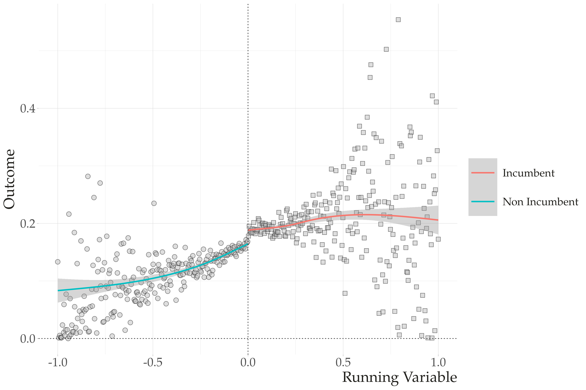
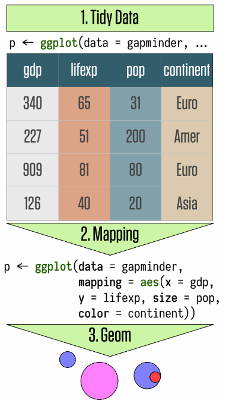
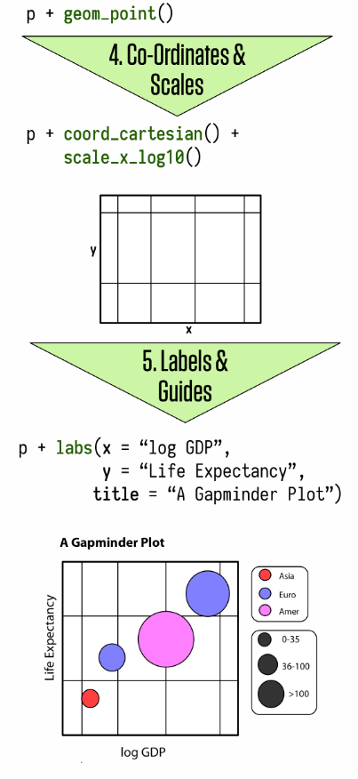

```{r setup, include=FALSE}
options(htmltools.dir.version = FALSE)
knitr::opts_chunk$set(message=FALSE, warning = FALSE)

``` 

## Main Ideas for this Workshop

--
- Hands-on Data Visualization Workshop.

--

- Show a complete workflow to build nice visualization.

--

- Prepare your data before plotting.
--

- Show you how to go from your models to nice visualizations. 

--

---

class: center, middle

# My approach

**Always better to present your results with a graph**

And keep all (or most of) your models and descriptive tables in the appendix. 

---
## How to get there?  (Summary)

--
- Basics of `ggplot`

--

- Tidy Data with `tidyR`

--

- `broom` to retrieve model quantities

--

- Case studies (from my own work)

---

class:inverse, center, middle 

# Basics of ggplot2

---
### What do you see? 

```{r  echo=FALSE, out.width = "100%"}
 
```


---

# How ggplot works

- Data Visualization involves connecting (mapping) variables from your data to graphical representations. 

- Ggplot provides you with a language to map data and to a plot. 

- Ggplot works by connecting data and visual components through a function called __aesthethics mapping__ (aes).

- Every graph is built layer by layer starting with your data, aesthetics mappings, geometric decisions, and then embelisshment of the plot. 

---

# Summary


.pull-left[
```{r  echo=FALSE, out.width = "70%"}
 
```
]

.pull-right[
```{r  echo=FALSE, out.width = "62%"}
 
```
]


---
class:inverse, center, middle

# Tidy your data
---

# Starting some coding

Let's first call our packages. I am using the package [packman](http://trinker.github.io/pacman/vignettes/Introduction_to_pacman.html) to help me manage my libraries.

```{r call packages}
pacman::p_load(tidyverse, gapminder, kableExtra, tidyr, ggthemes, patchwork, broom)
```

This is a tidy data:

```{r}
knitr::kable(head(gapminder), format = 'html')
```

---

# Tidy Data

There are three interrelated rules which make a [dataset tidy](https://r4ds.had.co.nz/tidy-data.html). 

- Each variable must have its own column.
- Each observation must have its own row.
- Each value must have its own cell.

```{r  echo=FALSE, out.width = "100%"}
knitr::include_graphics("tidy.png") 
```


---

# Getting our own data
```{r }
data <- read_csv("https://docs.google.com/spreadsheets/d/e/2PACX-1vQ56fySJKLL18Lipu1_i3ID9JE06voJEz2EXm6JW4Vh11zmndyTwejMavuNntzIWLY0RyhA1UsVEen0/pub?gid=0&single=true&output=csv")
```

### Is this data tidy? (You can say just checking colnames)
```{r echo=FALSE}
colnames(data)
```

---
# Pivoting to make the data tidy (Pivot Longer)

```{r comment='#'}
data_long <- data %>% 
               pivot_longer(cols=c(biden,trump), #<<
                            names_to="Vote_Choice", #<<
                            values_to="Vote") %>%  #<<
              mutate(end.date=as.Date(str_replace_all(end.date,
                              "/", "-"), format = "%m-%d-%Y"))

```

We have three inputs in `pivot_longer`: 

- `cols`: the variables you want to convert from wide to long.
- `names_to`: new variable for the columns names from the wide data.
- `values_to`: new variable for the values from the wide data. 

---

## And now: 

```{r}
data_long %>% 
  select(Vote_Choice, Vote) %>%
  slice(1:5)
```


```{r echo=FALSE}
national_polls <- data_long %>% filter(state=="--")
state_polls <- data_long %>% filter(state!="--")
swing_states <- c("PA", "FL", "GA", "AZ", "IO", "OH", "TX", "MI", "WI")
```

<br>
<br>

### .center[With this tidy dataset, we can start our visualizations.] 

---
class:inverse, center, middle

# Basics of ggplot
---

## Linking the Data to Visuals (Mapping).

Mapping is how you connect your data and variables with the visual representations of a graph. We will do this in two steps. 

--

- **The Data Step**: Tell ggplot what your data is.

--

- **The Mapping Step:** Tell ggplot **what** variables -> visuals you want to see.

--

- **The Geom Step:** Tell ggplot **how** you want to see

--

---

# Polls Over Time (Ugly but with the basics)

```{r out.width='60%', fig.height=5}
ggplot(data=national_polls, # the data step 
       aes(x=end.date, y=Vote)) + # the map step
geom_point() # the geom step
```

---

# Aesthethics: Color

```{r out.width='60%', fig.height=5}
ggplot(data=national_polls, # the data step
       aes(x=end.date, y=Vote, 
           color=Vote_Choice)) + # the map step
geom_point()

```
 
---

# Aesthethics: Shape

```{r  out.width='60%', fig.height=5}
ggplot(data=national_polls, # the data step
       aes(x=end.date, y=Vote,
           color=Vote_Choice,
           shape=Vote_Choice)) + # the map step
geom_point() 

```


---


# Aesthethics: Alpha

```{r  out.width="60%", fig.height=5}
ggplot(data=national_polls, # the data step
       aes(x=end.date, y=Vote,
           color=Vote_Choice,
           shape=Vote_Choice, 
           alpha=end.date)) + # the map step
geom_point() 
```

---

# Aesthethics: Linetype

```{r out.width='60%', fig.height=5}
ggplot(data=national_polls, # the data step
       aes(x=end.date, y=Vote)) + # the map step
geom_smooth(aes(linetype=Vote_Choice)) +
geom_point(aes(color=Vote_Choice), alpha=.2)
```

---

# Some notes

- You can use multiple aesthetics together. 

- One variables for each aesthethic (that's why your data should be tidy)

- Outside of Aes, the aesthetics work with a simple value, not a variable linking data and geoms. 


---
class:inverse, center, middle

# Geoms
---

# Smooting the data

```{r out.width='60%', fig.height=5}
ggplot(data=national_polls,
       aes(x=end.date, y=Vote, color=Vote_Choice, fill=Vote_Choice)) + 
geom_point(alpha=.2) +
geom_smooth()
```

---

# Density

```{r out.width='60%', fig.height=5}
ggplot(data=national_polls,
       aes(x=end.date)) +
geom_density(fill="steelblue")

```

---

# Nice Trick: facet wrap
```{r out.width='60%', fig.height=5}

ggplot(data=state_polls %>% filter(state%in%swing_states)) +
  geom_density(aes(x=end.date, fill=state), alpha=.3) +
  facet_wrap(~state, ncol=3)
```

---

# Bars

```{r out.width='60%', fig.height=5}
ggplot(data=data_long,
       aes(x=end.date, fill=mode)) +
geom_bar() +
scale_fill_brewer(palette = "Set3")
```

---

# Box Plot 


```{r out.width='60%', fig.height=5}
# Another example
ggplot(state_polls %>% filter(state%in%swing_states),
       aes(x=Vote,y=fct_rev(state), fill=Vote_Choice)) +
  geom_boxplot() +
  scale_fill_manual(values=c("biden"="blue","trump"="red")) 
```

---
class:inverse, center, middle

# And many, many, many more options. 

### See Materials in the website for this workshop

---

## Part 4: Adjust scales, labels,  titles, and more.

After you are set on the mapping and geoms, the next step is to adjust the scale of your the graph. These functions are usually on the form: `scale_aesthethic_type`. 

- `scale_x_log10`: To convert the numeric axis to the log scale
- `scale_y_reverse`: To reverse the scale
- `scale_fill_manual`: To create your own discrete set of fill. 
- `scale_colour_brewer()`: Change the Pallet of Colours


---


# Putting all together

```{r eval=FALSE}
p <- ggplot(data=national_polls,
       aes(x=end.date, y=Vote, color=Vote_Choice, 
           shape=Vote_Choice, fill=Vote_Choice)) + 
geom_point(alpha=.2) +
geom_smooth() +
scale_shape_manual(values =c(21, 23)) +
scale_fill_manual(values=c("red", "blue")) +
scale_color_manual(values=c("red", "blue"), 
                   labels=c("Biden", "Trump"), 
                   name= "Vote Choice") +
scale_x_date(date_breaks = "1 month", date_labels = "%b %d") +
guides(fill=FALSE, shape=FALSE) +
labs(x = "End of the Poll", y = "Results",
         title = "Polls US Presidential Election",
         subtitle = "",
         caption = "Source: The Economist")  
```


---
class: center, middle 

```{r echo=FALSE}
 ggplot(data=national_polls,
       aes(x=end.date, y=Vote, color=Vote_Choice, 
           shape=Vote_Choice, fill=Vote_Choice)) + 
geom_point(alpha=.2) +
geom_smooth() +
scale_shape_manual(values =c(21, 23)) +
scale_fill_manual(values=c("red", "blue")) +
scale_color_manual(values=c("red", "blue"), labels=c("Biden", "Trump"), 
                  name= "Vote Choice") +
scale_x_date(date_breaks = "1 month", date_labels = "%b %d") +
guides(fill=FALSE, shape=FALSE) +
labs(x = "End of the Poll", y = "Results",
         title = "Polls US Presidential Election",
         subtitle = "",
         caption = "Source: The Economist")  

```
---

# Part 5: Embellishment as an consistent workflow

- Most of the adjustments you can make on your plot go inside of the `theme` function.

- When working in a paper, you should be consistent with your graphs. 

- Create your own theme, and apply to all your codes. 

---

# Build Your Theme

```{r}

# Set up my theme  ------------------------------------------------------------
my_font <- "Palatino Linotype"
my_bkgd <- "#f5f5f2"
pal <- RColorBrewer::brewer.pal(9, "Spectral")
my_theme <- theme(text = element_text(family = my_font, color = "#22211d"),
            rect = element_rect(fill = my_bkgd),
            plot.background = element_rect(fill = my_bkgd, color = NA),
            panel.background = element_rect(fill = my_bkgd, color = NA),
            panel.border = element_rect(color="black"), 
            strip.background = element_rect(color="black", fill="gray85"), 
            legend.background = element_rect(fill = my_bkgd, color = NA),
            legend.key = element_rect(size = 6, fill = "white", colour = NA), 
            legend.key.size = unit(1, "cm"),
            legend.text = element_text(size = 10, family = my_font),
            legend.title = element_text(size=10),
            plot.title = element_text(size = 22, face = "bold", family=my_font),
            plot.subtitle = element_text(size=16, family=my_font),
            axis.title= element_text(size=14),
            axis.text = element_text(size=8, family=my_font),
            axis.title.x = element_text(hjust=1),
            strip.text = element_text(family = my_font, color = "#22211d",
                                            size = 10, face="italic"))

```

```{r eval=FALSE}

# This sets up for all your plots

theme_set(theme_bw() + my_theme) #<<

```
---

## Or by hand for each plot 

```{r echo=FALSE}
p <- ggplot(data=national_polls,
       aes(x=end.date, y=Vote, color=Vote_Choice, 
           shape=Vote_Choice, fill=Vote_Choice)) + 
geom_point(alpha=.2) +
geom_smooth() +
scale_shape_manual(values =c(21, 23)) +
scale_fill_manual(values=c("red", "blue")) +
scale_color_manual(values=c("red", "blue"), labels=c("Biden", "Trump"), 
                  name= "Vote Choice") +
scale_x_date(date_breaks = "1 month", date_labels = "%b %d") +
guides(fill=FALSE, shape=FALSE) +
labs(x = "End of the Poll", y = "Results",
         title = "Polls US Presidential Election",
         subtitle = "",
         caption = "Source: The Economist")  


```


.pull-left[
```{r eval=FALSE, out.width='50%'}
p +
  theme_bw() + 
  my_theme
```
]

--
.pull-right[
```{r echo=FALSE, out.width='100%'}
p +
  theme_bw() + 
  my_theme
```
]
--

---

# Pre-built plots

There are several packages in R and built-in in gpplot with pre-built themes. Some examples from `ggthemes` and `hrbrthemes`

- theme_minimal()

- theme_economist()

- theme_fivethirtyeight()

- theme_ipsum()

---

.pull-left[
```{r}
p +
  theme_minimal(base_size=12)
```
]


.pull-right[
```{r}
p +
  theme_fivethirtyeight() 
```
]

---
class:inverse, center, middle

# Modelling with Broom and Purrr
---

# Broom 

- We have discussed how to go from your raw data to informative visualization plots. 

- From this section forward, we will use the same logic to go from your statistical models outputs to plots. 

- We will use David Robinson’s `broom` package to help us out, and the tidyverse package `purrr`. 

### A Simple Model

```{r}
# Separate the data
biden <- national_polls %>%
      filter(Vote_Choice=="biden") %>%
      mutate(first_day=min(end.date, na.rm=TRUE), 
             days=as.numeric(end.date-first_day))

# simple linear model

lm_time <- lm(Vote~ days, data=biden)
```

---

# Extract Quantities with Broom

- `tidy`: to extract the model main parameters
- `augment`: to extract observation-level statistics (predictions)
- `glance`: to extract model-level statistics. 

## Tidy: Extract Quantities
```{r}
# a data frame
results <- tidy(lm_time)
results
```

---

# Augment: Predicted Values 

```{r}
augment(lm_time)
```

---

# Plot The Predicted Values

```{r out.width='60%', fig.height=5}
# Plot
augment(lm_time, se_fit = TRUE) %>% 
  mutate(lb=.fitted - 1.96*.se.fit, 
         ub=.fitted + 1.96*.se.fit) %>%
ggplot(data=.) +  geom_ribbon(aes(y=.fitted, ymin=lb,
                  ymax=ub, x=days), alpha=.2) +
  geom_line(aes(y=.fitted, x=days), color="blue") +
  geom_point(aes(y = Vote, x=days), alpha=.2) 
```

--- 
---

## Running Multiple Models

What if I want to run the same model for multiple subgroups? Or multiple different models? 

Use `purrr` for functional programming. This is where R and tidyverse gets really beautiful.

The logic is simple. We will nest our data, run models in the subgroups, tidy the results, and unnest everything in a tidy format dataset.


--- 
---

## Nest the Data 

```{r}
# Step 1: Nest your data
nested_data <- state_polls %>%
                 filter(Vote_Choice=="biden") %>%
                 mutate(first_day=min(end.date, na.rm=TRUE), 
                         days=as.numeric(end.date-first_day)) %>%
                 group_by(state) %>% #<<
                 nest() #<<

nested_data
```

The data column is called a [list-column](https://jennybc.github.io/purrr-tutorial/ls13_list-columns.html) because it works as a list where every element has a entire dataset. 

With a list of datasets, we can use functional programming in `purrr` to run the same models for each dataset. 

---

## Run the Models

```{r}

nested_data <- nested_data %>%
                mutate(model=map(data, ~ lm(Vote~days, .x))) #<<

nested_data
```

---
## Unnest (All back to normal)
```{r}
nested_data <- nested_data %>% 
                     mutate(results=map(model, tidy)) %>%
                     unnest(results) #<<

nested_data
```

---

## Outputs from Unnest

```{r eval=FALSE}

# first, remove the intercept
to_plot <- nested_data %>%
              filter(term!="(Intercept)") %>%
              mutate(ub=estimate+1.96*std.error, 
                     lb=estimate-1.96*std.error)  %>%
              drop_na()
# graph
ggplot(to_plot, aes(x=fct_rev(state),y=estimate, ymin=lb, ymax=ub)) +
  geom_pointrange(shape=21, fill="blue", color="black", alpha=.8) +
  geom_hline(yintercept = 0, linetype="dashed", color="gray") +
  coord_flip() +
  theme_minimal() +
  labs(x = "Linear Time Trend by State",  y= "Biden Support in the Polls")  

```

---

class: center, middle 

```{r echo=FALSE}

# first, remove the intercept
to_plot <- nested_data %>%
              filter(term!="(Intercept)") %>%
              mutate(ub=estimate+1.96*std.error, 
                     lb=estimate-1.96*std.error)  %>%
              drop_na()
# graph
ggplot(to_plot, aes(x=fct_rev(state),y=estimate, ymin=lb, ymax=ub)) +
  geom_pointrange(shape=21, fill="blue", color="black", alpha=.8) +
  geom_hline(yintercept = 0, linetype="dashed", color="gray") +
  coord_flip() +
  theme_minimal() +
  labs(x = "Linear Time Trend by State",  y= "Biden Support in the Polls")  

```


---
class:inverse, center, middle

# Case Study: 

## Partisanship, Covid and Risk Perceptions in Brazil. 
---

# An Example of my Workflow

--

- To conclude our workshop, I will show you the code my recent paper (co-authored with Ernesto Calvo) forthcoming at the Latin American Politics and Society. 

- The paper is about partisanship and risk perceptions about COVID-19. I will focus on the descriptive analysis and the simple regression models we use to show partisan difference of risk perceptions in Brazil.

- The paper and replication files can be found [here](https://github.com/TiagoVentura/Calvo_Ventura_LAPS_2021). 

- **Our Goal**: A model of partisanship on three different outcomes. 
--

---

##  Step1: Tidy Your Data

```{r}
load("CV_data.Rdata")
library(tidyverse)
library(tidyr)

# Untidy
d %>% select(covid_job, covid_health, covid_government)
```

---

## Make it tidy

```{r}
d_pivot <- d %>% 
            pivot_longer(cols=c(covid_job, covid_health, 
                                covid_government), 
                         names_to="covid", 
                         values_to="covid_values") 


```

---

## What do I have now?

```{r echo=FALSE}

d_pivot %>% select(covid, covid_values)

```


---

## Nest and Models

```{r}
data_nested <- d_pivot %>%
                group_by(covid) %>%
                nest() %>%
                mutate(model=map(data, ~ 
                              lm(as.numeric(covid_values) ~ #<<
                                 runoff_haddad +  #<<
                                 runoff_bolsonaro + #<<
                                 income + gender + work + #<<
                                 as.numeric(education) + age , data=.x)), #<<
                       res=map(model,tidy)) %>%
                unnest(res) %>%
                mutate(lb=estimate - 1.96*std.error, 
                       up= estimate + 1.96*std.error)
```


**Everything we need is here: group_by, nest, model, unnest. **

.center[

]


---

# Next (Important Steps)

- Fix the labels. 

- **Get your labels correct before plotting**. 

- By correct I mean: names and order. 

--

```{r}
to_plot <- data_nested %>% 
              filter(str_detect(term, "runoff")) %>%
              mutate(labels_iv=fct_recode(term, "Haddad Voters"="runoff_haddadOn", 
                                                "Bolsonaro Voters"="runoff_bolsonaroOn")) %>%
              mutate(outcome= ifelse(covid=="covid_job", 
                         "How likely is it that you \n could lose your job? ",
                         ifelse(covid=="covid_health", 
                                "How likely will your health \n be affected by COVID-19?", 
                                "Has the government response \n been appropriate ?"))) 

```

---
# Final Plot

```{r eval=FALSE}
#pick my colors
pal <- RColorBrewer::brewer.pal(9, "Spectral")

#graph
ggplot(to_plot, aes(y=estimate, x=labels_iv, 
                      ymin=up, ymax=lb, color=labels_iv)) +
  geom_pointrange(shape=21, fill="white", size=2) +
  labs(x="", y="Point Estimates", 
       title = "\nPartisanship, Risk Perceptions and Government Responses to Covid in Brazil", 
       subtitle = "Regression Estimates with Controls by Income, Gender, Age, Education, and Occupation.", 
       caption ="Note: Baseline are Independent Voters") +
  geom_hline(yintercept = 0, linetype="dashed", color="darkred") + 
  scale_color_manual(values=c("Bolsonaro Voters"=pal[9], "Haddad Voters"=pal[1]),
                     name="Who would you vote for?") +
  facet_wrap(~outcome)  + 
  theme_bw() +
  theme(strip.text = element_text(size=7),
        axis.text.x = element_blank()) 
        

```

---

class: center, middle

```{r, echo=FALSE}
#pick my colors
pal <- RColorBrewer::brewer.pal(9, "Spectral")

#graph
ggplot(to_plot, aes(y=estimate, x=labels_iv, 
                      ymin=up, ymax=lb, color=labels_iv)) +
  geom_pointrange(shape=21, fill="white", size=2) +
  labs(x="", y="Point Estimates", 
       title = "\nPartisanship, Risk Perceptions and Government Responses to Covid in Brazil", 
       subtitle = "Regression Estimates with Controls by Income, Gender, Age, Education, and Occupation.", 
       caption ="Note: Baseline are Independent Voters") +
  geom_hline(yintercept = 0, linetype="dashed", color="darkred") + 
  scale_color_manual(values=c("Bolsonaro Voters"=pal[9], "Haddad Voters"=pal[1]),
                     name="Who would you vote for?") +
  facet_wrap(~outcome)  + 
  theme_bw() +
  theme(strip.text = element_text(size=7),
        axis.text.x = element_blank()) 
        

```

